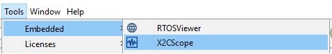

 
# MPLAB X Project: DSPIC33CK LVMC X2CSCOPE BLINKY

This is a X2Cscope demo project for [Low Voltage Motor Control (LVMC)](https://www.microchip.com/DevelopmentTools/ProductDetails/PartNO/DM330031) development board and [dsPIC33CK256MP508](https://www.microchip.com/wwwproducts/en/dsPIC33CK256MP508) microcontroller that is available as a PIM (Plug in Module). 

The purpose is to demonstrate the [X2Cscope firmware based debugger tool](https://x2cscope.github.io/) features like run-time watch and scope views.

The code functionality is minimalistic in order to avoid unneceseary confusion. The firmware generates a digital sawtooth and a sine signal. There is LED1 that is blinking with the sawtooth signal's period. The LED2 can be controlled manually by the [X2Cscope run-time debugger tool](https://x2cscope.github.io/). The state of the SW1 can be read out by X2Cscope.

## Getting Started

The demo is ready to use with the [listed hardwares below](#hardware).

1. Clone or Download zipped project.
2. [Connect Hardware](#connectors-used).
3. Open project with MPLAB X
4. Build project
5. Program the Hardware (HW) with the PICkit on board
6. Verify LED1 is blinking

## Use X2Cscope

The X2Cscope tool uses the UART to transfer data from and to the HW. To use this feature follow the steps:

1. Verify if X2Cscope plug-in is installed within MPLAB X. Detailed user guide: https://x2cscope.github.io/
2. Open X2Cscope 

3. Verify UART settings at the Connection Setup tab and also check the COM port number on the PC. (device manager)

4. Connect to the HW with clicking on the connect sign:

6. Use the Watch and Scope data views (available on the Data Views tab).

## Hardware

* **LVMC dev board:** [DM330031](https://www.microchip.com/DevelopmentTools/ProductDetails/PartNO/DM330031) Low voltage motor control development board with [dsPIC33CK256MP508] (https://www.microchip.com/wwwproducts/en/dsPIC33CK256MP508) MCU populated on board

### Connectors used:

* **J1/J2:** 24V Power supply
* **J13 USB:** PICkit on board 4 (PKOB4) programmer debugger
* **J6 USB-UART:** Used to connect UART to computer 

### Configuration

LVMC board is used in the default configuration. 

The LVMC board is capable to configure different signal routing modes by zero Ohm jumper resistors. For details see the [LVMC user guide](https://www.microchip.com/DevelopmentTools/ProductDetails/PartNO/DM330031). 

* **UART:** J6 MCP2200 USB-UART chip is used for X2Cscope run-time debugging 
## Peripheral settings and I/O connections: 

**UART:**
   * Baud rate: 115200
   * Parity: None
   * Data bits: 8
   * Stop bits: 1
   * Flow control: no

**TIMER1:**
   * 1ms period
   * interrupt enabled

**IO**

| PIN | PORT   | Function |
| ----|--------|----------|
|  14 | RD13   | UART1 TX |
|  13 | RD14   | UART1 RX |
|  37 | RE6    | IO_LED1  |
|  39 | RE7    | IO_LED2  |
|  59 | RE11   | IO_SW1   |
|  62 | RE12   | IO_SW2   |

   Peripherals are configured by [MCC](https://microchipdeveloper.com/mcc:mccgpio) according to the LVMC board [schematics](https://www.microchip.com/DevelopmentTools/ProductDetails/PartNO/DM330031).

   If you need more details of peripheral configuration, just open MPLAB X then MCC with the MCC button:  
   

## Software

To use the demo only the MPLAB X IDE and XC16 compiler is required. 

* [MPLAB X](https://www.microchip.com/mplab/mplab-x-ide) Integrated Development Environment. 
* [XC16 Compiler:](https://www.microchip.com/mplab/compilers) Compiler for the Microchip 16bit MCUs
## Built With

* [XC16 v1.60](https://www.microchip.com/mplab/compilers) - Microchip C compiler for 16bit micros
* [MCC v4.0.2](https://www.microchip.com/mplab/mplab-code-configurator) - Configure peripherals and generate low levev drivers
* [X2Cscope v0.5](https://x2cscope.github.io/) - Run-time firmware based debugger tool
